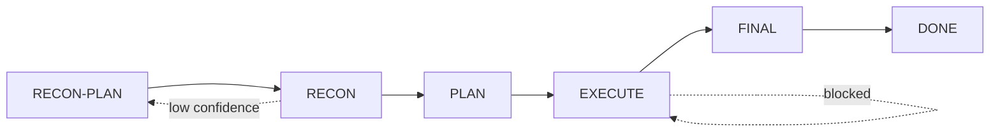

# autodev

autonomous software-development loop for oh-my-pi

> [中文版文档](docs/README.zh.md) · [Architecture](docs/ARCHITECTURE.md) · [Testing](docs/TESTING.md) · [Design Decisions](docs/DESIGN_DECISIONS.md) · [ADRs](docs/adr/) · [Installation](docs/INSTALL.md) · [Changelog](CHANGELOG.md)

autodev is a **meta-agent** that orchestrates LLM subagents through a YAML-persisted state machine to complete coding tasks autonomously. It does not directly modify files or run commands -- it operates a state machine that does. v1.1.0 adds **named subagents** with tool whitelists enforced by omp frontmatter — no more prompt-only safety boundaries.

## Quick Start

```bash
# 1. Install
omp plugin install @williamcodebox/autodev

# 2. Restart omp or reload extensions

# 3. Start
/autodev "add user authentication to the API"
```

For detailed installation options (including migration from v1.0.0 tarball installs), see [INSTALL.md](docs/INSTALL.md).

## Architecture at a Glance

autodev runs a five-phase loop, each phase enforced by the state machine:



- **RECON-PLAN**: `autodev-scout` agent decides what to investigate
- **RECON**: Isolated scout instances per dimension return structured dossiers with file:line evidence
- **PLAN**: TwoRoundGate — `autodev-gatekeeper` R1 draft + R2 fan-out of N isolated adversarial auditors
- **EXECUTE**: `autodev-implementer` runs Design→Implement→Verify within `.omp/` firewall constraint
- **FINAL**: Build standard + final check

[Full architecture diagram and details >](docs/ARCHITECTURE.md)

## Key Features

- **Named subagents** — tool whitelists enforced by omp frontmatter; no prompt-only safety boundaries
- **YAML-persisted state machine** — crash recovery via resume anchor; all state changes auditable
- **TwoRoundGate** — adversarial acceptance criteria review (R1 draft, R2 N isolated auditors per constitution)
- **Dynamic recon dimensions** — LLM decides what to investigate per task, not hardcoded templates
- **HITL/HOTL/auto** — three modes, same core loop, zero divergence
- **Tool-layer hardening** — machine gate `pass` requires verify evidence; HOTL pause is machine-enforced
- **Context budget guardrails** — hard tool-level gate prevents context overflow
- **Slice boundary handoff** — prevents context rot across long tasks

## Learn More

| Document | What's Inside |
|----------|-------------|
| [Architecture](docs/ARCHITECTURE.md) | Full loop diagram, all 8 design features, project structure |
| [Testing](docs/TESTING.md) | Two-axis methodology, coverage matrix, running tests |
| [Design Decisions](docs/DESIGN_DECISIONS.md) | Why YAML? Why separate tools? Why hard gates? Limitations |
| [Installation](docs/INSTALL.md) | Global vs project-level install, verification, uninstall |

## License

MIT
