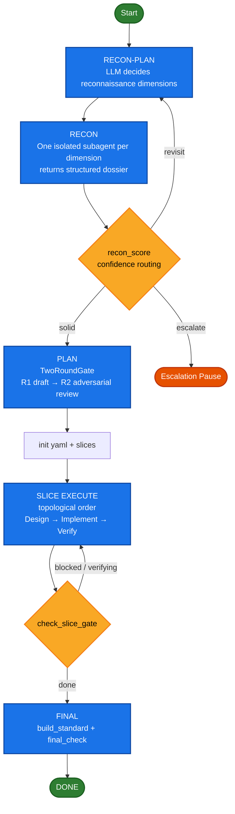

# autodev

autonomous software-development loop for oh-my-pi

> [中文版文档](README.zh.md)

## Architecture Overview

autodev is a **meta-agent**: it does not directly manipulate files or invoke shell commands. Instead, it orchestrates LLM subagents through a state machine to complete coding tasks. Its loop consists of five phases, each rigidly enforced by the state machine:



The design spans three layers: **Control Architecture** (state machine & orchestration), **Tool Interface** (subagent dual-channel contract), and **Resource Management** (context budget & persistence).

> [!NOTE]
> autodev is still in early stages. The core state machine is stable and covered by tests (Axis 1),
> but the LLM's adherence to the prompt flow is still being optimized with adversarial testing (Axis 2).
> Issues and PRs are welcome.

---

## Design Philosophy: Orchestrate a State Machine, Not Agents

autodev orchestrates a **state machine** -- task state transitions, slice stage progression, gate adjudication, recon confidence routing, and replan attempt tracking are all modeled as operations on a YAML-backed state machine. The parent agent does not directly invoke subagents to execute code; instead, it operates this state machine: `transition_task` marks a task done, `check_slice_gate` advances a slice stage, and `replan` increments the retry counter. Subagent fan-out is a side effect of entering a particular stage, not the goal of orchestration.

This differs fundamentally from orchestrating agent execution (which agent runs what in which sandbox):
- Orchestrating agent execution: the system's source of truth is the agent call stack and event stream; recovery relies on replay after a crash.
- Orchestrating a state machine: the system's source of truth is the YAML snapshot on disk; after a crash, the current state is read directly.

Orchestrating agent execution is like "scheduling OS processes" -- entities are processes, and the framework decides who runs. Orchestrating a state machine is like "database transactions" -- entities are persistent state, and operations must satisfy invariants. The former focuses on control flow, the latter on data integrity.

## Core Design Features

### 1. YAML-Persisted State Machine (Source of Truth)

All autodev state is persisted to the `.omp/autodev/` directory:

- **`autodev.yaml`**: top-level snapshot (goal, slice metadata, recon dimensions, gate acceptance criteria, context budget configuration)
- **`slices/<id>.yaml`**: each slice's tasks / acceptance_criteria / stage / replan_attempts
- **`run.json`**: append-only event log recording every critical operation
- **`artifacts/`**: durable dual-write directory; artifacts written to both local:// (session-scoped) and this directory (persistent)
- **`handoffs/S{id}.md`**: slice boundary handoff files for new session anchoring

The state machine library (`autodev-state.mjs`) is a standalone pure-JS library -- loaded by the omp runtime and directly runnable with `node` for testing. Key invariants:

- Task state transitions have legal edges (todo → doing → done / blocked, done is terminal)
- Slice stage is auto-derived by `reconcileSliceStage`; `check_slice_gate` actually writes to disk
- `final_standard`'s mandatory / developer_seed items cannot be deleted (`validateGateInvariants` automatically restores them)
- Atomic writes (write-temp + rename) prevent last-write-wins in concurrent RMW

This design ensures: **crash recovery via resume anchor**, and all state changes are auditable through the log.

### 2. TwoRoundGate (Adversarial Acceptance Review)

All critical acceptance criteria (top-level plan, per-slice design, final verification) go through the same primitive:

- **R1**: Fan out to N isolated subagents, each drafting acceptance gates (mixed machine + llm_judge), returning `local://gate-*.md` + lightweight JSON summary
- **Parent integration**: Consolidate into a proposal
- **R2**: Fan out to N isolated adversarial subagents, each independently finding loopholes
- **Mandatory item invariant**: Compile/build/test etc. mandatory items and developer_seed items cannot be removed by R2 at the state machine level; if deleted, `validateGateInvariants` automatically restores them with a warning

R2 is not "one agent doing a review" -- it is N isolated subagents each independently reviewing. This is more robust against bias than a single reviewer.

### 3. LLM-Driven Reconnaissance Dimensions (Dynamic Decomposition)

autodev's reconnaissance dimensions are dynamically generated by the LLM based on the goal and developer_seed, not hardcoded. Workflow:

1. **RECON-PLAN**: Fan out to N subagents, each proposing a set of dimensions (id / title / rationale / weight / suggested_tools / expected_artifact). The base taxonomy is only a candidate seed; the LLM can add, remove, or modify.
2. **RECON**: Dispatch isolated subagents per dimension for reconnaissance, returning structured dossiers with `file:line` evidence.
3. **Confidence scoring** (recon_score): Each dimension computes `confidence(0~1)` + `evidence_status` (covered / partial / missing / contradicted), routing to:
   - **solid** (>= threshold): proceed to PLAN
   - **revisit** (< threshold and recon_pass < 2): do another reconnaissance round
   - **escalate** (< threshold and recon_pass >= 2): escalation pause (prevents infinite "reconnaissance → still low score" loop)
4. **Low-confidence high-risk dimensions** (e.g., numerical_risk / mpi_boundary) must not be locked before reaching solid.

This is the "meta-retrieval" paradigm -- deciding what to search matters more than how to search.

### 4. Three-Layer Human Intervention (Same Core, No Branches)

Three modes stack on the same core loop with zero state machine divergence:

| Mode | Entry | Behavior |
|------|-------|----------|
| **auto** | `/autodev` | Fully autonomous |
| **HITL** (human-in-the-loop) | `/autodev hitl` | Pauses at 4 approval points for human judgment; tool layer hard-blocks on unresolved gates |
| **HOTL** (human-on-the-loop) | `/autodev hotl` | Agent is autonomous; human can steer/pause/cancel at any time |

Key design constraints (P0-7):

- `mode` is only a command source marker; HOTL activation is uniquely determined by `hotl.mode=supervised`; the two intervention layers are mutually exclusive
- Explicit entry set to eliminate YAML residual contamination (previous intervention layer leaking into the current run)
- When a HITL pending gate exists, `transition_task` / `check_slice_gate` returns `BLOCKED_BY_PENDING_GATE` at the tool layer -- not a suggestion to pause, but a real hard block
- HOTL steer is auto-absorbed at the tool layer (`transition_task` / `check_slice_gate` / `replan` internally call `hotl_poll`)
- On receiving `hotl_pause` / `hotl_cancel` as a STRONG INSTRUCTION, must stop immediately -- this is machine-enforced
- Replan exceeding the limit converges to `loop_state=paused`; humans use `/autodev lifecycle resume` to recover

Control plane (cross-mode): `gate` (approval), `steer` (inject instructions), `lifecycle` (pause/resume/cancel), `status` (query state), `config` (dynamic configuration).

### 5. Context Budget Guardrails (Hard Tool-Level Gate)

The parent agent's context is always kept in the "optimal zone," enforced by a hard tool-level gate:

- **Three-zone percentage** (relative to model window, not absolute values):
  - **green** (used < targetPct, e.g., 40%): normal progress, loading allowed
  - **amber** (targetPct <= used < hardCeilingPct, e.g., 50%): evict-only; LRU eviction before any new load
  - **red** (used >= hardCeilingPct): hard stop; must compact or handoff
- **evaluateReadGate** (pure function, testable): called before loading any `local://` or `artifacts/` content; returning `allowed: false` causes the tool to refuse returning content
- **Fixed working set**: resident = goal + invariants + current slice digest + next 1-3 tasks; everything else is in YAML / local://, loaded on demand
- **Pinned protection**: goal + invariants are never evicted by LRU

### 6. Slice Boundary Handoff (Prevents Context Rot)

On completing each slice (`check_slice_gate` returns `stage: done`):

1. Write `.omp/autodev/handoffs/S{id}.md` (five sections: State / Context / Intent / Return path / Verification, no Risks section)
2. Invoke the native `/handoff` with that file as the prompt to open a new session
3. The new session loads only the handoff + its own slice YAML, always starting from green

This prevents long tasks from degrading due to cumulative context.

### 7. Genuine Verification

The `verify` command is actually executed by the state machine tool -- it spawns a process, runs the command, and judges by the exit code. It does not trust subagent self-reported PASS. A failed verify persists durable artifacts + writes a journal entry. Verification is a first-class state machine operation, not a special case.

### 8. Subagent Dual-Channel Contract

All subagents follow the same contract:

- **Heavy artifacts**: written to `local://{role}-{slug}.md` and `artifacts/` (durable dual-write)
- **Return value**: lightweight JSON only:
  ```json
  { "status": "success|partial|blocked",
    "ref": "local://...md",
    "summary": "1-3 sentence conclusion",
    "findings": ["file:line ..."],
    "next_action_or_blocker": "..." }
  ```
- The parent agent consumes only `summary + ref` by default, reading `local://...md` only when verification or decision is needed

The benefit: the parent context carries only lightweight references; heavy artifacts are loaded only when needed.

---

## Testing Methodology (Two-Axis Testing)

autodev's reliability depends on two layers -- state machine hard logic (deterministic verification) + LLM prompt adherence (adversarial review):

### Axis 1: Code Correctness (Deterministic Verification)

Runs under `fs.mkdtempSync()` with real YAML I/O, driven by operation sequences (init → transitionTask → replan → checkSliceGate → checkFinalGate), asserting disk state at each step. The state library is the same code loaded by the omp runtime (no mocks).

### Axis 2: Prompt Constraint (Adversarial Review)

Collects a state bundle (YAML + run.json + logs) → fans out to N isolated subagents, each auditing one dimension (state machine legality, YAML completeness, gate correctness, boundary conditions), returning a JSON verdict.

Why use an LLM to review an LLM? Prompt constraints are a semantic problem -- "does the model understand and follow the given procedure." The most economical way to judge is to have another model examine the output from an adversarial perspective.

> [!TIP]
> Run tests: `node tests/run-integration.mjs` (Axis 1), add `--omp` to enable Axis 2 adversarial review.
> Use `--list` to list available scenarios, `--only=SceneName` to filter.

### 7-Scenario Coverage Matrix

| Scenario | Axis | Coverage |
|----------|------|----------|
| happy-path | Code | init → slice → task → reconcile → final gate full cycle |
| blocked-replan | Code | doing → blocked → replan → exceeded → paused |
| hitl-mode | Code | three-layer mutual exclusion, pending gate hard block, approve unblock |
| gate-invariants | Code | R2 deletes mandatory → validateGateInvariants restores |
| hotl-steer | Code | steer → poll → pause → resume → cancel |
| e2e-omp | Prompt | `omp -p` runs autodev (auto-skips without omp) |
| context-budget | Code | three-zone, readGate hard reject, LRU eviction |

---

## Key Design Decisions (Why)

### Why dynamic (not hardcoded) reconnaissance dimensions

Dynamic decomposition adapts better to task variance than static templates. "Let the LLM decide what to investigate" is a proven PLAN-stage strategy. Reconnaissance dimensions are generated artifacts, auditable in `autodev.yaml`, not constants.

### Why YAML instead of in-memory state

Persistent state supports crash recovery, audit trails, and asynchronous collaboration (multiple people see the same YAML). This is because once the orchestration target shifts from "call stack / event stream" to "state machine", there must be a **queryable, assertable, recoverable** source of truth. YAML snapshots + run.json append-only logs provide both snapshot recovery and historical replay -- the same pattern as database WAL + checkpoint.

### Why separate parent-agent and subagent tools

The parent agent sees state operation tools (transition task, advance stage, gates), while subagents see file operation tools. This layering prevents a single LLM from operating both state and files at the same time, avoiding the confused deputy problem.

### Why context budget is a hard tool-level gate, not model self-awareness

Models won't self-reject. Only a tool can intercept at load time. `evaluateReadGate` is a pure function, testable -- it doesn't depend on the model's "judgment."

### Why HITL/HOTL are not two separate codebases

All three modes share the same core loop. This means core logic (state machine transitions, gate advancement, replan) is tested once, and there's no risk of "auto fixed a bug but the hitl branch forgot it."

> [!CAUTION]
> autodev **does not provide sandbox isolation** -- code execution relies on omp's process isolation.
> There is currently no event-driven entry point, no PR/Git workflow, and it is bound to the omp framework.
> See the limitations table below for details.

---

## Limitations

| # | Limitation | Impact |
|---|-----------|--------|
| 1 | **No sandbox isolation** | Code execution relies on omp's process isolation; cannot run untrusted code |
| 2 | **No event-driven entry** | Fully manual `/autodev` startup; no GitHub webhook / CI integration |
| 3 | **Single-model routing** | All phases use the same model; no tiered routing (small model for recon, large model for design) |
| 4 | **No PR/Git workflow** | No auto commit/PR after verify passes; results stay as local file modifications |
| 5 | **No conversational correction** | HITL is approval-style (accept/deny/force), not interactive edit-by-conversation |
| 6 | **Bound to omp framework** | Cannot be used independently |

---

## Project Structure

```
src/
  commands/
    autodev.md               # /autodev command (main loop prompt + subcommand dispatch)
  tools/autodev/
    index.ts                 # omp custom tool (registers 13+ intervention operations)
    lib/
      autodev-state.mjs      # State machine core (standalone testable pure JS kernel)
      hitl-gates.mjs         # HITL approval points + adjudication logic
      hotl-steer.mjs         # HOTL monitoring/control + tool-layer steer absorption
      recon-score.mjs        # Recon dimension confidence scoring
      js-yaml.mjs            # YAML serialization
tests/
  test-state.mjs               # State machine unit tests
  test-hitl.mjs                # HITL tests
  test-hotl.mjs                # HOTL tests
  test-integration.mjs         # Integration tests
  test-commands.mjs            # Command surface consistency tests
  test-prompts.mjs             # Prompt structural integrity tests (110 items)
  test-prompts-consistency.mjs # Prompt cross-consistency tests (29 items)
  prompt-behavior.mjs          # Prompt behavior regression (LLM contract adherence, 15 items)
  run-integration.mjs          # Test runner entry point
  integration/
    runner.mjs                 # Integration test runner
    review.mjs                 # Adversarial review runner
    scenarios/                 # 8 scenario test definitions
    lib/                       # Integration test utility functions
```
