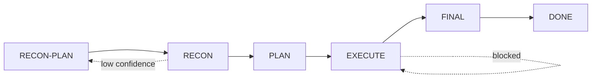

# autodev

autonomous software-development loop for oh-my-pi

> [中文版文档](README.zh.md) | [Architecture](docs/ARCHITECTURE.md) | [Testing](docs/TESTING.md) | [Design Decisions](docs/DESIGN_DECISIONS.md) | [Installation](INSTALL.md)

autodev is a **meta-agent** that orchestrates LLM subagents through a YAML-persisted state machine to complete coding tasks autonomously. It does not directly modify files or run commands -- it operates a state machine that does.

> [!NOTE]
> Early stage. Core state machine is stable and tested (Axis 1). LLM prompt adherence is being optimized via adversarial testing (Axis 2). Issues and PRs welcome.

## Quick Start

```bash
# 1. Install (project-level)
tar -xzf autodev-v7-offline.tar.gz -C .omp/

# 2. Restart omp or reload extensions

# 3. Start
/autodev "add user authentication to the API"
```

For detailed installation options, see [INSTALL.md](INSTALL.md).

## Architecture at a Glance

autodev runs a five-phase loop, each phase enforced by the state machine:



- **RECON-PLAN**: LLM decides what to investigate
- **RECON**: Isolated subagents per dimension return structured dossiers
- **PLAN**: Two-round adversarial gate review (draft + critique)
- **EXECUTE**: Sliced topological execution: Design -> Implement -> Verify
- **FINAL**: Build standard + final check

[Full architecture diagram and details >](docs/ARCHITECTURE.md)

## Key Features

- **YAML-persisted state machine** -- crash recovery via resume anchor; all state changes auditable
- **TwoRoundGate** -- adversarial acceptance criteria review (R1 draft, R2 loophole finding)
- **Dynamic recon dimensions** -- LLM decides what to investigate per task, not hardcoded templates
- **HITL/HOTL/auto** -- three modes, same core loop, zero divergence
- **Context budget guardrails** -- hard tool-level gate prevents context overflow
- **Slice boundary handoff** -- prevents context rot across long tasks

## Learn More

| Document | What's Inside |
|----------|-------------|
| [Architecture](docs/ARCHITECTURE.md) | Full loop diagram, all 8 design features, project structure |
| [Testing](docs/TESTING.md) | Two-axis methodology, coverage matrix, running tests |
| [Design Decisions](docs/DESIGN_DECISIONS.md) | Why YAML? Why separate tools? Why hard gates? Limitations |
| [Installation](INSTALL.md) | Global vs project-level install, verification, uninstall |

## License

MIT
