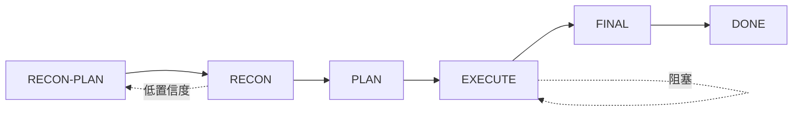

# autodev

适用于 oh-my-pi 的自主软件开发循环

> [English](README.md) | [架构文档](docs/ARCHITECTURE.md) | [测试](docs/TESTING.md) | [设计决策](docs/DESIGN_DECISIONS.md) | [安装](INSTALL.md)

autodev 是一个 **meta-agent**：它不直接操作文件或调用 shell，而是通过 YAML 持久化状态机编排 LLM subagent 自主完成编码任务。

> [!NOTE]
> 早期阶段。核心状态机已稳定并经过测试覆盖（轴一），LLM 对提示词流程的服从度仍在对抗式测试优化中（轴二）。欢迎提交 issue 或 PR。

## 快速开始

```bash
# 1. 安装（项目级）
tar -xzf autodev-v7-offline.tar.gz -C .omp/

# 2. 重启 omp 或重载扩展

# 3. 启动
/autodev "给 API 加上用户认证"
```

详细安装说明见 [INSTALL.md](INSTALL.md)。

## 架构概览

autodev 运行五阶段循环，每阶段由状态机硬约束推进：



- **RECON-PLAN**：LLM 决定调查什么
- **RECON**：隔离 subagent 按维度返回结构化报告
- **PLAN**：两轮对抗式方案审查（起草 + 找漏洞）
- **EXECUTE**：拓扑序切片执行：Design -> Implement -> Verify
- **FINAL**：构建标准 + 最终检查

[完整架构图与细节 >](docs/ARCHITECTURE.md)

## 核心特性

- **YAML 持久化状态机** -- 崩溃可恢复，所有变更可审计
- **TwoRoundGate** -- 对抗式验收标准审查（R1 起草、R2 挑漏洞）
- **动态侦察维度** -- LLM 按任务决定调查哪些维度，非硬编码
- **HITL/HOTL/auto 三层模式** -- 同核心零分叉
- **上下文预算护栏** -- 工具级硬闸门防上下文溢出
- **Slice 边界 handoff** -- 防长任务上下文退化

## 了解更多

| 文档 | 内容 |
|------|------|
| [架构](docs/ARCHITECTURE.md) | 完整循环图、8 个设计特性、项目结构 |
| [测试](docs/TESTING.md) | 两轴方法论、覆盖矩阵、运行测试 |
| [设计决策](docs/DESIGN_DECISIONS.md) | 为什么用 YAML？为什么分离工具？局限与未解问题 |
| [安装](INSTALL.md) | 全局 vs 项目级安装、校验、卸载 |

## License

MIT
