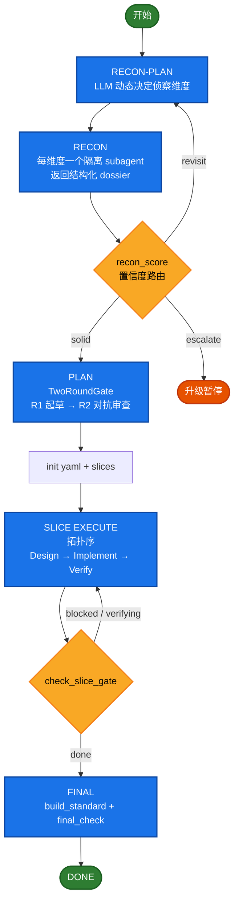

# autodev

autonomous software-development loop for oh-my-pi

## 架构总览

autodev 是一个 **meta-agent**：它不直接操作文件或调用 shell，而是通过状态机编排 LLM subagent 来完成编码任务。其循环分为五个阶段，每个阶段由状态机硬约束推进：



设计分为三层：**控制架构层**（状态机与编排）、**工具接口层**（subagent 双通道契约）、**资源管理层**（上下文预算与持久化）。

> [!NOTE]
> autodev 还处于早期阶段。核心状态机已稳定并经过测试覆盖（轴一），
> 但 LLM 对提示词流程的服从度仍在对抗式测试优化中（轴二）。
> 欢迎提交 issue 或 PR。

---

## 设计哲学：编排状态机，而非编排 Agent

autodev 的编排对象是**状态机**——task 状态迁移、slice stage 推进、gate 门控裁决、recon 置信度路由、replan 次数跟踪，全部建模为 YAML 状态机上的操作。父 agent 不直接调用 subagent 执行代码，而是操作这个状态机：transition_task 标记 task 完成、check_slice_gate 推进 slice stage、replan 增加重试计数器。subagent 扇出是状态机进入特定 stage 后的副作用，不是编排的目标。

这与编排 agent 执行（哪个 agent 在哪个 sandbox 上跑什么工具）有本质区别：
- 编排 agent 执行时，系统的真理来源是 agent 调用栈和事件流，崩溃后靠重放恢复
- 编排状态机时，系统的真理来源是磁盘上的 YAML 快照，崩溃后直接读当前状态

编排 agent 执行可以类比为"调度操作系统进程"——实体是进程，框架决定谁运行；编排状态机类比为"数据库事务"——实体是持久化状态，操作必须满足不变式。前者聚焦控制流，后者聚焦数据完整性。

## 核心设计特性

### 1. YAML 持久化状态机（真理来源）

autodev 的全部状态持久化到 `.omp/autodev/` 目录：

- **`autodev.yaml`**：顶层快照（goal、slices 元数据、recon 维度、gate 验收标准、上下文预算配置）
- **`slices/<id>.yaml`**：每个 slice 的 tasks / acceptance_criteria / stage / replan_attempts
- **`run.json`**：append-only 事件日志，记录每次关键操作
- **`artifacts/`**：durable 双写目录，产物同时写入 local://（会话级）和此目录（持久级）
- **`handoffs/S{id}.md`**：slice 边界交接文件，供新会话锚定

状态机 lib（`autodev-state.mjs`）是独立的纯 JS 库——既被 omp 运行时加载，又能直接 `node` 跑测试。关键约束：

- task 状态迁移有合法边（todo → doing → done / blocked，done 为终态）
- slice stage 由 reconcileSliceStage 自动推导，check_slice_gate 真实落盘
- final_standard 的 mandatory/developer_seed 项不可删除（validateGateInvariants 自动补回）
- 原子写（write-temp + rename），避免并发 RMW 的 last-write-wins

这个设计保证：**崩溃后可用 resume anchor 恢复**，所有状态变更都有日志可审计。

### 2. TwoRoundGate（对抗式方案验收）

所有关键验收标准（顶层方案、每 slice 设计、最终验收）走同一原语：

- **R1**：扇出 N 个隔离 subagent，各自起草验收门控（machine + llm_judge 混合），返回 `local://gate-*.md` + 轻量 JSON summary
- **父整合**：综合成提案
- **R2**：扇出 N 个隔离 adversarial subagent，独立找 loopholes
- **强制项不变式**：编译/构建/测试等 mandatory 项与 developer_seed 项在状态机层面不可被 R2 删除，若被删则 validateGateInvariants 自动补回并报错

R2 不是"一个 agent 做 review"——它是 N 个隔离 subagent 各自独立审查。这比单一审查者更抗偏见。

### 3. LLM 驱动的侦察维度（动态分解）

autodev 的侦察维度由 LLM 基于目标和 developer_seed 动态生成，而非硬编码。工作流程：

1. **RECON-PLAN**：扇出 N 个 subagent，提议一组维度（id / title / rationale / weight / suggested_tools / expected_artifact）。base taxonomy 仅作候选种子，LLM 可增删改。
2. **RECON**：按维度派隔离 subagent 侦察，返回 `file:line` 证据的结构化 dossier。
3. **置信度评分**（recon_score）：每个维度算 `confidence(0~1)` + `evidence_status`（covered / partial / missing / contradicted），路由到：
   - **solid**（≥ 阈值）：进 PLAN
   - **revisit**（< 阈值且 recon_pass < 2）：再侦察一轮
   - **escalate**（< 阈值且 recon_pass ≥ 2）：升级暂停（防"再侦察→仍低分"死循环）
4. **低置信高风险维度**（如 numerical_risk / mpi_boundary）未达 solid 前不得锁定方案。

这是"元检索"范式——决定搜什么比怎么搜更重要。

### 4. 三层人类干预（同核心、不分支）

三种模式在同一核心循环叠加，状态机零分叉：

| 模式 | 入口 | 行为 |
|------|------|------|
| **auto** | `/autodev` | 完全自治 |
| **HITL**（人在环） | `/autodev hitl` | 4 个审批点暂停等人裁决，未裁决 gate 时工具层硬阻塞 |
| **HOTL**（人在环上） | `/autodev hotl` | Agent 自治，人类可随时 steer/pause/cancel |

关键设计约束（P0-7）：

- `mode` 仅作命令来源标记；HOTL 激活唯一由 `hotl.mode=supervised` 决定；两干预层互斥
- 入口显式置位，消除 YAML 残留污染（上次的干预层泄漏到本次）
- HITL pending gate 存在时，`transition_task` / `check_slice_gate` 在工具层返回 `BLOCKED_BY_PENDING_GATE`——不是建议暂停，是真实硬阻塞
- HOTL 的 steer 在工具层自动吸收（transition_task / check_slice_gate / replan 内部调用 hotl_poll）
- 收到 `hotl_pause` / `hotl_cancel` 的 STRONG INSTRUCTION 必须立即停手，这是机器强制
- replan 超限收敛到 `loop_state=paused`，人类用 `/autodev lifecycle resume` 恢复

控制面（跨模式通用）：`gate`（审批）、`steer`（注入指令）、`lifecycle`（暂停/恢复/取消）、`status`（状态查询）、`config`（动态配置）。

### 5. 上下文预算护栏（工具级硬闸门）

父 agent 的上下文始终保持在"最优区域"，由一道工具级硬闸门强制：

- **三态百分比**（相对模型窗口，不写死绝对值）：
  - **green**（used < targetPct 如 40%）：正常推进，允许加载
  - **amber**（targetPct ≤ used < hardCeilingPct 如 50%）：只出不进，新加载前先 LRU 驱逐
  - **red**（used ≥ hardCeilingPct）：硬停，必须 compact 或 handoff
- **evaluateReadGate**（纯函数，可测试）：每次加载 `local://` 或 `artifacts/` 内容前调用，返回 `allowed: false` 时工具拒绝返回内容
- **工作集固定**：常驻 = goal + invariants + 当前 slice digest + 下 1-3 task；其余在 YAML / local:// 中，按需加载
- **pinned 保护**：goal + invariants 永不被 LRU 驱逐

### 6. Slice 边界 Handoff（防上下文 rot）

每完成一个 slice（`check_slice_gate` 返回 `stage: done`）：

1. 写 `.omp/autodev/handoffs/S{id}.md`（State / Context / Intent / Return path / Verification 五段，无 Risks 段）
2. 调原生 `/handoff` 以该文件为 prompt 开新会话
3. 新会话只载 handoff + 自己的 slice YAML，永远从 green 起

这保证了长任务不因上下文累积而退化。

### 7. 真实验证

`verify` 命令由状态机 tool 实际执行——spawn 进程跑命令、据退出码判定。不采信 subagent 自报的 PASS。失败的 verify 会落 durable 产物 + 写 journal。验证作为状态机的一等操作，而非特例。

### 8. Subagent 双通道契约

所有 subagent 遵循同一契约：

- **重产物**：写到 `local://{role}-{slug}.md` 和 `artifacts/`（durable 双写）
- **返回值**：只能是轻量 JSON：
  ```
  { "status": "success|partial|blocked",
    "ref": "local://...md",
    "summary": "1~3 句结论",
    "findings": ["file:line ..."],
    "next_action_or_blocker": "..." }
  ```
- 父 agent 默认只消费 `summary + ref`，仅在需验证/决策时才 `read local://...md`

这种契约的收益：父上下文只有轻量引用，重产物在需要时才加载。

---

## 测试方法论（两轴测试）

autodev 的可靠性取决于两层——状态机硬逻辑（确定性验证）+ LLM 对提示词的服从（对抗式审查）：

### 轴一：代码正确性（确定性验证）

在 `fs.mkdtempSync()` 下做真实 YAML I/O，按操作序列驱动（init → transitionTask → replan → checkSliceGate → checkFinalGate），每步断言磁盘状态。state lib 是 omp 运行时加载的同一份代码（无 mock）。

### 轴二：提示词约束（对抗式审查）

收集 state bundle（YAML + run.json + 日志）→ 扇出 N 个隔离 subagent，各审一个维度（状态机合法性、YAML 完整性、门控正确性、边界条件），回 JSON 裁决。

为什么用 LLM 审 LLM：提示词约束是语义问题——"模型是否理解并执行了给定流程"。最经济的判断方式是让另一个模型用 adversarial 视角审查产出。

> [!TIP]
> 运行测试：`node tests/run-integration.mjs`（轴一），加 `--omp` 启用轴二对抗式审查。
> `--list` 列出可用场景，`--only=SceneName` 过滤执行。

### 7 场景覆盖矩阵

| 场景 | 轴 | 覆盖 |
|------|----|------|
| happy-path | 代码 | init→slice→task→reconcile→final gate 全闭环 |
| blocked-replan | 代码 | doing→blocked→replan→超限 paused |
| hitl-mode | 代码 | 三层互斥、pending gate 硬阻塞、approve 解除 |
| gate-invariants | 代码 | R2 删 mandatory→validateGateInvariants 补回 |
| hotl-steer | 代码 | steer→poll→pause→resume→cancel |
| e2e-omp | 提示词 | omp -p 跑 autodev（无 omp 自动 skip） |
| context-budget | 代码 | 三态 zone、readGate 硬拒绝、LRU 驱逐 |

---

## 关键设计决策（Why）

### 为什么不硬编码侦察维度

动态分解比静态模板更能适应任务方差。"让 LLM 决定要调查什么"是已验证的 PLAN 阶段策略。侦察维度是生成产物，在 autodev.yaml 中可审计，不是常量。

### 为什么用 YAML 而非内存状态

持久化状态支持崩溃恢复、审计回顾、异步协作（多人看到同一 YAML）。这是因为一旦编排对象从"操作栈/事件流"变为"状态机",就必须有一个**可查询、可断言、可恢复**的真相来源。YAML 快照 + run.json append-only 日志提供了快照恢复和历史回放两种能力——这与数据库的 WAL + checkpoint 是同一模式。

### 为什么区分父 agent 工具和 subagent 工具

父 agent 看到的工具是状态操作（转换 task、推进 stage、门控），subagent 看到的工具是文件操作。这种分层防止单一 LLM 既操作状态又操作文件时产生偏差（confused deputy）。

### 为什么上下文预算是工具级硬闸门而非模型自觉

模型不会拒绝自己。只有工具可以在加载阶段就拦截。evaluateReadGate 是纯函数，可测试——不依赖模型的"判断力"。

### 为什么不把 HITL/HOTL 做成两份代码

三模式共享同一核心循环意味着核心逻辑（状态机迁移、门控推进、replan）只测试一份，不会出现"auto 修了 bug 但 hitl 分支忘修"的问题。

> [!CAUTION]
> autodev **不提供沙箱隔离**——代码执行依赖 omp 的进程隔离。
> 目前无事件触发入口、无 PR/Git 工作流、绑定 omp 框架。
> 详见下方局限表格。

---

## 局限与未解决的问题

| # | 局限 | 影响 |
|---|---|---|
| 1 | **无沙箱隔离** | 代码执行依赖 omp 的进程隔离，不可执行未知代码 |
| 2 | **无事件触发入口** | 全手动 `/autodev` 启动，无 GitHub webhook / CI 集成 |
| 3 | **单模型路由** | 全部阶段用同一模型，无"小模型做侦察、大模型做设计"的分级 |
| 4 | **无 PR/Git 工作流** | verify 通过后不自动 commit/PR，结果在本地文件修改 |
| 5 | **无对话式纠错** | HITL 是审批式（accept/deny/force），不是边看边对话修改 |
| 6 | **绑定 omp 框架** | 不能独立使用 |

---

## 项目结构

```
src/
  commands/
    autodev.md               # /autodev 命令（主循环 prompt + 子命令分发）
  tools/autodev/
    index.ts                 # omp 自定义 tool（注册 13+ intervention ops）
    lib/
      autodev-state.mjs      # 状态机核心（独立可测的纯 JS 内核）
      hitl-gates.mjs         # HITL 审批点 + 裁决逻辑
      hotl-steer.mjs         # HOTL 监控/控制 + 工具层 steer 吸收
      recon-score.mjs        # recon 维度置信度打分
      js-yaml.mjs            # YAML 序列化
tests/
  test-state.mjs               # 状态机单元测试
  test-hitl.mjs                # HITL 测试
  test-hotl.mjs                # HOTL 测试
  test-integration.mjs         # 集成测试
  test-commands.mjs            # 命令表面一致性测试
  test-prompts.mjs             # 提示词结构完整性测试（110 项）
  test-prompts-consistency.mjs # 提示词交叉一致性测试（29 项）
  prompt-behavior.mjs          # 提示词行为回归（LLM 契约遵守，15 项）
  run-integration.mjs          # 测试运行入口
  integration/
    runner.mjs                 # 集成测试运行器
    review.mjs                 # 对抗式审查运行器
    scenarios/                 # 8 个场景的测试定义
    lib/                       # 集成测试工具函数
```
