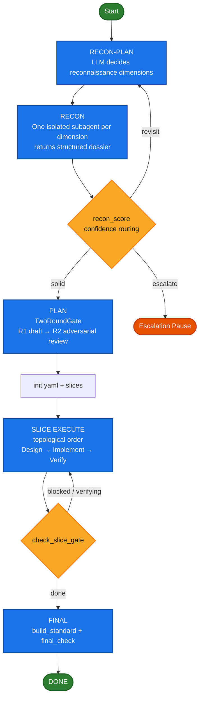

# Architecture

## Design Philosophy: Orchestrate a State Machine, Not Agents

autodev orchestrates a **state machine** -- task state transitions, slice stage progression, gate adjudication, recon confidence routing, and replan attempt tracking are all modeled as operations on a YAML-backed state machine. The parent agent does not directly invoke subagents to execute code; instead, it operates this state machine: `transition_task` marks a task done, `check_slice_gate` advances a slice stage, and `replan` increments the retry counter. Subagent fan-out is a side effect of entering a particular stage, not the goal of orchestration.

This differs fundamentally from orchestrating agent execution (which agent runs what in which sandbox):

| Approach | Source of Truth | Recovery |
|----------|---------------|----------|
| Orchestrating agent execution | Agent call stack + event stream | Replay after crash |
| Orchestrating a state machine | YAML snapshot on disk | Read current state after crash |

Orchestrating agent execution is like "scheduling OS processes" -- entities are processes, and the framework decides who runs. Orchestrating a state machine is like "database transactions" -- entities are persistent state, and operations must satisfy invariants.

## Loop Overview

autodev is a **meta-agent**: it does not directly manipulate files or invoke shell commands. Instead, it orchestrates LLM subagents through a state machine to complete coding tasks. Its loop consists of five phases, each rigidly enforced by the state machine:



The design spans three layers: **Control Architecture** (state machine & orchestration), **Tool Interface** (subagent dual-channel contract), and **Resource Management** (context budget & persistence).

## Core Features

### 1. YAML-Persisted State Machine (Source of Truth)

All autodev state is persisted to `.omp/autodev/`:

- **`autodev.yaml`**: top-level snapshot (goal, slice metadata, recon dimensions, gate acceptance criteria, context budget configuration)
- **`slices/<id>.yaml`**: each slice's tasks / acceptance_criteria / stage / replan_attempts
- **`run.json`**: append-only event log recording every critical operation
- **`artifacts/`**: durable dual-write directory; artifacts written to both `local://` (session-scoped) and this directory (persistent)
- **`handoffs/S{id}.md`**: slice boundary handoff files for new session anchoring

The state machine library (`autodev-state.mjs`) is a standalone pure-JS library -- loaded by the omp runtime and directly runnable with `node` for testing. Key invariants:

- Task state transitions have legal edges (todo -> doing -> done / blocked, done is terminal)
- Slice stage is auto-derived by `reconcileSliceStage`; `check_slice_gate` actually writes to disk
- `final_standard`'s mandatory / developer_seed items cannot be deleted (`validateGateInvariants` automatically restores them)
- Atomic writes (write-temp + rename) prevent last-write-wins in concurrent RMW

Crash recovery via resume anchor; all state changes auditable through the log.

### 2. TwoRoundGate (Adversarial Acceptance Review)

All critical acceptance criteria (top-level plan, per-slice design, final verification) go through the same primitive:

- **R1**: Fan out to N isolated subagents, each drafting acceptance gates (mixed `machine` + `llm_judge`), returning `local://gate-*.md` + lightweight JSON summary
- **Parent integration**: Consolidate into a proposal
- **R2**: Fan out to N isolated adversarial subagents, each independently finding loopholes
- **Mandatory item invariant**: Compile/build/test etc. mandatory items and developer_seed items cannot be removed by R2 at the state machine level; if deleted, `validateGateInvariants` automatically restores them with a warning

R2 is N isolated subagents each independently reviewing -- more robust against bias than a single reviewer.

### 3. LLM-Driven Reconnaissance Dimensions (Dynamic Decomposition)

Reconnaissance dimensions are dynamically generated by the LLM based on the goal and developer_seed, not hardcoded:

1. **RECON-PLAN**: Fan out to N subagents, each proposing dimensions (id / title / rationale / weight / suggested_tools / expected_artifact). Base taxonomy is only a candidate seed; LLM can add, remove, or modify.
2. **RECON**: Dispatch isolated subagents per dimension, returning structured dossiers with `file:line` evidence.
3. **Confidence scoring** (`recon_score`): Each dimension computes `confidence(0~1)` + `evidence_status` (covered / partial / missing / contradicted), routing to:
   - **solid** (>= threshold): proceed to PLAN
   - **revisit** (< threshold and recon_pass < 2): do another reconnaissance round
   - **escalate** (< threshold and recon_pass >= 2): escalation pause (prevents infinite loop)
4. **Low-confidence high-risk dimensions** (e.g., numerical_risk / mpi_boundary) must not be locked before reaching solid.

### 4. Three-Layer Human Intervention (Same Core, No Branches)

Three modes stack on the same core loop with zero state machine divergence:

| Mode | Entry | Behavior |
|------|-------|----------|
| **auto** | `/autodev` | Fully autonomous |
| **HITL** (human-in-the-loop) | `/autodev hitl` | Pauses at 4 approval points for human judgment; tool layer hard-blocks on unresolved gates |
| **HOTL** (human-on-the-loop) | `/autodev hotl` | Agent is autonomous; human can steer/pause/cancel at any time |

Key design constraints (P0-7):

- `mode` is only a command source marker; HOTL activation uniquely determined by `hotl.mode=supervised`; two intervention layers are mutually exclusive
- Explicit entry set eliminates YAML residual contamination (previous intervention layer leaking into current run)
- HITL pending gate: `transition_task` / `check_slice_gate` returns `BLOCKED_BY_PENDING_GATE` -- a real hard block, not a suggestion
- HOTL steer auto-absorbed at tool layer (`transition_task` / `check_slice_gate` / `replan` internally call `hotl_poll`)
- On `hotl_pause` / `hotl_cancel` as STRONG INSTRUCTION: must stop immediately -- machine-enforced
- Replan exceeding limit converges to `loop_state=paused`; `/autodev lifecycle resume` to recover

Control plane (cross-mode): `gate` (approval), `steer` (inject instructions), `lifecycle` (pause/resume/cancel), `status` (query state), `config` (dynamic configuration).

### 5. Context Budget Guardrails (Hard Tool-Level Gate)

Parent agent's context kept in the "optimal zone," enforced by a hard tool-level gate:

- **Three-zone percentage** (relative to model window):
  - **green** (used < targetPct, e.g., 40%): normal progress, loading allowed
  - **amber** (targetPct <= used < hardCeilingPct, e.g., 50%): evict-only; LRU eviction before any new load
  - **red** (used >= hardCeilingPct): hard stop; must compact or handoff
- **evaluateReadGate** (pure function, testable): called before loading any `local://` or `artifacts/` content; returning `allowed: false` causes the tool to refuse returning content
- **Fixed working set**: resident = goal + invariants + current slice digest + next 1-3 tasks; everything else in YAML / `local://`, loaded on demand
- **Pinned protection**: goal + invariants never evicted by LRU

### 6. Slice Boundary Handoff (Prevents Context Rot)

On completing each slice (`check_slice_gate` returns `stage: done`):

1. Write `.omp/autodev/handoffs/S{id}.md` (five sections: State / Context / Intent / Return path / Verification, no Risks section)
2. Invoke the native `/handoff` with that file as the prompt to open a new session
3. New session loads only the handoff + its own slice YAML, always starting from green

### 7. Genuine Verification

The `verify` command is actually executed by the state machine tool -- it spawns a process, runs the command, and judges by exit code. It does not trust subagent self-reported PASS. A failed verify persists durable artifacts + writes a journal entry. Verification is a first-class state machine operation, not a special case.

### 8. Subagent Dual-Channel Contract

All subagents follow the same contract:

- **Heavy artifacts**: written to `local://{role}-{slug}.md` and `artifacts/` (durable dual-write)
- **Return value**: lightweight JSON only:
  ```json
  { "status": "success|partial|blocked",
    "ref": "local://...md",
    "summary": "1-3 sentence conclusion",
    "findings": ["file:line ..."],
    "next_action_or_blocker": "..." }
  ```
- Parent agent consumes only `summary + ref` by default; reads `local://...md` only when verification or decision is needed

Parent context carries only lightweight references; heavy artifacts loaded only when needed.
